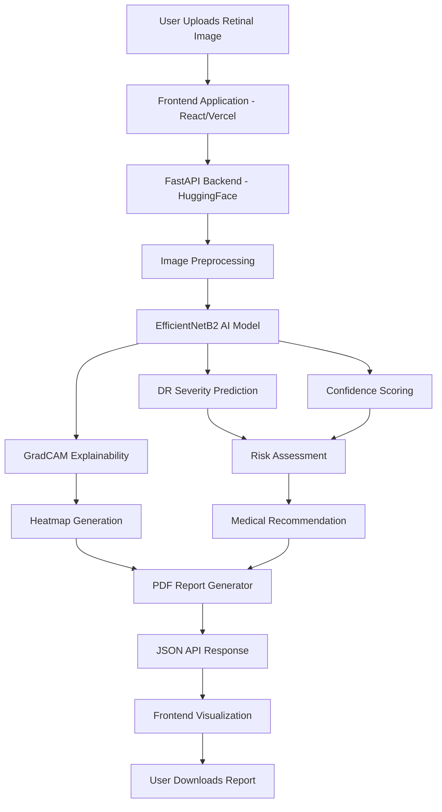
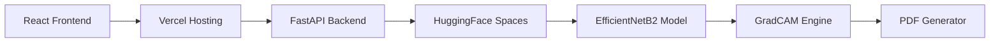
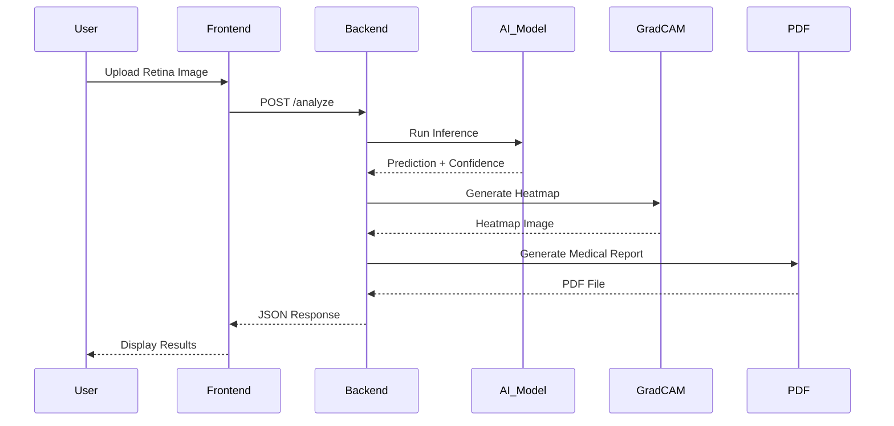

# 👁️ RetaniaScan-AI

## AI-Powered Diabetic Retinopathy Detection System

RetaniaScan-AI is a full-stack AI healthcare platform for automated diabetic retinopathy detection using deep learning, explainable AI, and cloud deployment.

The system combines:

- 🧠 EfficientNetB2 retinal classification
- 🔥 GradCAM explainability heatmaps
- 📄 Automated PDF medical reports
- ⚡ FastAPI backend deployment
- 🌐 Modern React/Vercel frontend
- 🤗 HuggingFace AI hosting

---

# 🚀 Features

✅ Diabetic Retinopathy Severity Classification  
✅ EfficientNetB2 Deep Learning Model  
✅ Explainable AI using GradCAM  
✅ Confidence Score Analysis  
✅ Risk Level Prediction  
✅ Automated Medical Recommendations  
✅ PDF Medical Report Generation  
✅ FastAPI REST API Backend  
✅ HuggingFace Spaces Deployment  
✅ React + Vercel Frontend Support  
✅ Dockerized AI Backend  
✅ Full AI Workflow Integration  

---

# 🧠 AI Model Information

| Component | Details |
|---|---|
| Model | EfficientNetB2 |
| Framework | PyTorch |
| Classes | 5 |
| Explainability | GradCAM |
| Backend | FastAPI |
| Frontend | React + Vite |
| Backend Hosting | HuggingFace Spaces |
| Frontend Hosting | Vercel |

---

# 🏗️ Complete System Architecture



---

# 🌐 Full Stack Deployment Architecture



---

# 🔄 Complete Data Flow



---

# 📁 Project Structure

```text
retaniascan-ai/
│
├── app/
│   ├── config.py
│   ├── gradcam.py
│   ├── inference.py
│   ├── main.py
│   ├── report_generator.py
│   └── utils.py
│
├── dataset/
│
├── hf-backend/
│   ├── app/
│   ├── models/
│   ├── Dockerfile
│   ├── main.py
│   └── requirements.txt
│
├── models/
│   └── efficientnet/
│
├── notebooks/
│
├── outputs/
│
├── scripts/
│
├── frontend/
│
├── app.py
├── requirements.txt
└── README.md
```

---

# 🔥 GradCAM Explainability

RetaniaScan-AI uses GradCAM to visualize retinal regions that influenced the AI model's prediction.

### Heatmap Interpretation

| Color | Meaning |
|---|---|
| 🔴 Red | Highest influence |
| 🟠 Orange | Strong influence |
| 🟢 Green | Moderate influence |
| 🔵 Blue | Low influence |

This improves:
- AI transparency
- Clinical interpretability
- Medical trustworthiness

---

# 📄 PDF Medical Reports

The system automatically generates downloadable PDF reports containing:

- Uploaded retinal image
- DR severity prediction
- Confidence score
- Risk level
- GradCAM heatmap
- AI recommendation
- Timestamp
- Disclaimer

---

# ⚙️ Backend Setup Instructions

## 1️⃣ Clone Repository

```bash
git clone YOUR_REPOSITORY_URL
```

---

## 2️⃣ Create Virtual Environment

### Windows

```bash
python -m venv venv
```

Activate:

```bash
venv\Scripts\activate
```

---

### Linux / Mac

```bash
python3 -m venv venv
```

Activate:

```bash
source venv/bin/activate
```

---

## 3️⃣ Install Dependencies

```bash
pip install -r requirements.txt
```

---

# 🚀 Run FastAPI Backend Locally

Navigate to:

```bash
cd hf-backend
```

Run:

```bash
uvicorn main:app --reload
```

---

# 📘 Open API Documentation

```text
http://127.0.0.1:8000/docs
```

---

# 🐳 Docker Deployment

## Build Docker Image

```bash
docker build -t retaniascan-backend .
```

---

## Run Docker Container

```bash
docker run -p 7860:7860 retaniascan-backend
```

---

# 🤗 HuggingFace Backend Deployment

## Create Space

Select:
- SDK → Docker

---

## Push Backend

```bash
git init
git add .
git commit -m "Initial deployment"
git branch -M main
git remote add origin YOUR_HF_SPACE_URL
git push -u origin main
```

---

# 🌐 Frontend Setup Instructions

## Create Frontend

```bash
npm create vite@latest
```

Select:
- React
- JavaScript

---

## Install Frontend Dependencies

```bash
npm install
```

---

## Run Frontend

```bash
npm run dev
```

---

# 🔌 Backend API Integration

Example frontend API call:

```javascript
const formData = new FormData();

formData.append("file", imageFile);

const response = await fetch(
  "https://YOUR_HF_BACKEND/analyze",
  {
    method: "POST",
    body: formData,
  }
);

const data = await response.json();
```

---

# ☁️ Frontend Deployment (Vercel)

## Install Vercel CLI

```bash
npm install -g vercel
```

---

## Deploy

```bash
vercel
```

---

# 📊 Example API Response

```json
{
  "prediction": "No DR",
  "confidence": "99.59%",
  "second_prediction": "Mild DR (0.18%)",
  "risk_level": "Low Risk",
  "confidence_status": "Prediction Confidence Acceptable",
  "recommendation": "Routine eye checkup recommended.",
  "heatmap_base64": "...",
  "pdf_report_path": "..."
}
```

---

# 🔐 Security & Disclaimer

⚠️ This project is designed for:

- Educational purposes
- AI research
- Demonstration systems

It is NOT intended to replace professional medical diagnosis.

Always consult certified ophthalmologists for clinical decisions.

---

# 🔮 Future Improvements

- Multi-model AI ensemble
- Retina image quality assessment
- User authentication
- Patient history dashboard
- ONNX optimization
- GPU acceleration
- Cloud database integration
- Multi-language support
- Mobile application

---

# 👨‍💻 Developer

## Mayank Kumar

RetaniaScan-AI — AI-Powered Retinal Screening System

---